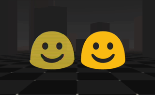

# A-Frame Hologram Shader

<p align="center">
  
  
  <a href="https://travisbarrydick.github.io/aframe-hologram-shader/dist/index.html"> Interactive Demo </a>
</p>

## Description of Effect

This shader corrupts an image or video texture to make it look like a hologram. There are three main effects applied:

1. The texture can be made transparent and desaturated.
1. Scan lines (dark horizontal lines) are drawn on the image. These scanlines slowly drift down the hologram.
1. Glitch effect: The texture is broken up vertically into equal-height "glitch bars". Each glitch bar is randomly shifted horizontally to create a jittering effect. After the horizontal shift, each of the RGBA components of the glitch bar are further randomly shifted to create a "glitch" effect. The boundaries between glitch bars slowly drift down the hologram.

## Installation

You can use `aframe-hologram-shader` in your project in two ways. First, you can simply include the following script tag after the script that loads a-frame:

```html
<script src="https://unpkg.com/aframe-hologram-shader"></script>
```

This will automatically register the hologram shader.

Alternatively, you can install the package using npm by executing

```
npm install aframe-hologram-shader
```

and then in your project you will need to either `include` or `require` the `aframe-hologram-shader` package.

## Example Usage

Once `aframe-hologram-shader` is installed, you can apply the shader to an image or video in your a-frame scene by setting the `material`'s `shader` attribute to be `hologram`. The other parameters of the shader (described below) are also set on the `material` component. For example:

```html
<html>
  <head>
    <title>Hologram</title>
    <script src="https://aframe.io/releases/1.2.0/aframe.min.js"></script>
    <script src="https://unpkg.com/aframe-hologram-shader"></script>
  </head>
  <body>
    <a-scene background="color: #ECECEC">
      <a-assets>
        
      </a-assets>
      <a-image
        src="#demo"
        position="0 1.6 -1"
        material="shader: hologram;
                         numGlitchBars: 20"
      >
      </a-image>
    </a-scene>
  </body>
</html>
```

## Configurable Parameters

The following parameters can be used to customize the effect. You can play with their values in the <a href="https://travisbarrydick.github.io/aframe-hologram-shader/dist/index.html">interactive demo</a>.

| Parameter      | Type  | Description                                                                                                                                                                         |
| -------------- | ----- | ----------------------------------------------------------------------------------------------------------------------------------------------------------------------------------- |
| src            | map   | Texture to display on the hologram. Can be an image or video.                                                                                                                       |
| numScanLines   | int   | The number of scan lines to draw on the texture.                                                                                                                                    |
| scanLineDrift  | float | The speed that the scanlines move down the texture. Should be a number in `[0,1]` which is the fraction of the hologram each scanline moves per second                              |
| saturation     | float | The saturation of each fragment in the HSV color space is scaled by this value. A value of `0` makes the hologram grayscale, while a value of `1` leaves the saturation unmodified. |
| alpha          | float | The alpha value of each fragment is multiplied by this parameter. Values of `0` and `1` result in completely transparent and opaque holograms, respectively.                        |
| numGlitchBars  | int   | The number of glitch bars to use in the effect.                                                                                                                                     |
| glitchOffset   | float | Maximum horizontal offset for each glitch bar. Should be a number in `[0,1]`, which is the maximum fraction of the holgoram width that each glitch bar can move.                    |
| glitchBarDrift | float | Similar to the scan line drift, except it causes the boundaries of the glitch bars to move.                                                                                         |
| rgbSeparation  | float | Similar to glitchOffset, except this is the maximum shift for each of the RGBA components.                                                                                          |
| glitchRate     | float | How many times per second to update the glitch effect.                                                                                                                              |
